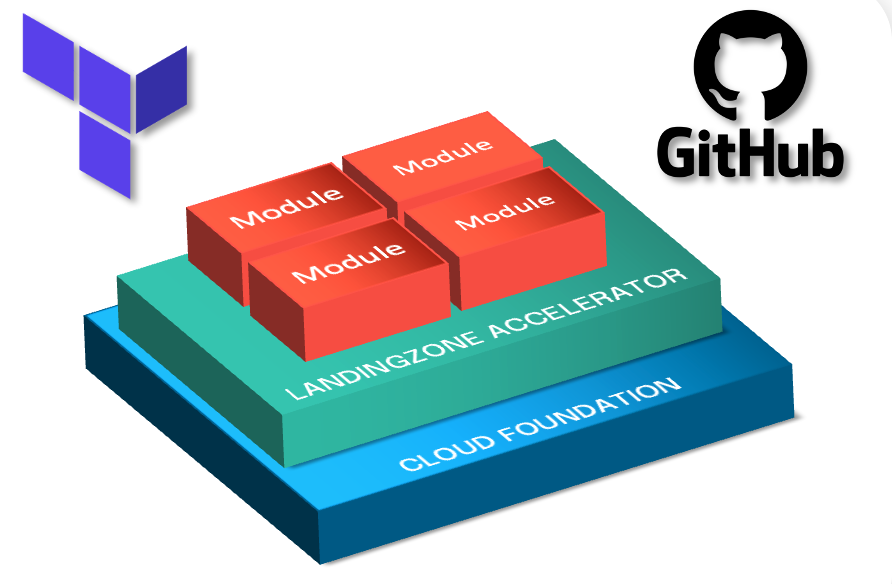

## What are Well Architected Modules?

Well Architected Modules (WAM) represent CloudNation's unified approach to defining and delivering high-quality Infrastructure as Code (IaC) modules. Our goal is to establish a single, consistent standard for creating, consuming, and maintaining IaC modules that align with best practices and the well-architected framework.

### Key Objectives:
- Define how modules should be constructed and built.
- Enforce consistency and testing wherever possible.
- Simplify module consumption for users.
- Deliver reliable resources and configurations for consumers.
- Align modules across public cloud platforms (e.g., Azure, Databricks).

Our mission is to provide a comprehensive library of Well Architected Modules across multiple IaC repositories. These modules, supported by Microsoft, will accelerate Azure resource deployment and architectural patterns, empowering organizations worldwide on their IaC journey.

## Summary of "Well Architected" Principles

- Modules are supported by CloudNation and its internal organizations [See here](module_support.html).
- Modules adhere to clear specifications ensuring consistency across all WAM modules (see "Specifications & Definitions").
- Modules are kept up-to-date with product/service roadmaps by their owners and contributors.
- Modules align with Well-Architected Framework (WAF) recommendations (see "What does WAM mean by 'WAF Aligned'?").
- Modules include clear documentation and examples to promote self-service consumption.
- Modules are rigorously tested to ensure compliance with WAM specifications and proper functionality.

## Why Do We Need Well Architected Modules?

The creation of Well Architected Modules addresses the challenges posed by the diverse and fragmented approaches to IaC module development across CloudNation. Existing efforts often lack consistency in code styling, consumption methods, testing frameworks, and support statements, leading to confusion and inefficiencies for customers and partners.

By establishing a unified strategy and definition for IaC modules, we can:
- Accelerate current and future projects, such as Application Landing Zone Accelerators (LZAs).
- Provide a trusted, consistent, and supported library of modules in multiple languages.
- Enable faster adoption and deployment for consumers at any stage of their IaC journey.

This initiative will reduce confusion and frustration, fostering a collaborative community to create more Well Architected Modules.

## How Will We Create, Support, and Enforce Well Architected Modules?

The WAM Core Team will drive the creation, support, and enforcement of Well Architected Modules by implementing the following:

- Publishing WAM modules to public registries for consumption (e.g., HashiCorp Terraform Registry for Terraform modules).
- Creating and maintaining Well Architected Modules specifications, including IaC language-specific guidelines (currently focused on Terraform).
- Providing clear contribution and publishing guidance for each IaC language.
- Enforcing compliance with WAM specifications through unit, integration, and end-to-end deployment tests.
- Offering long-term support for WAM modules, regardless of ownership status.
- Backing all efforts with the WAM Core Team of CloudNation.


